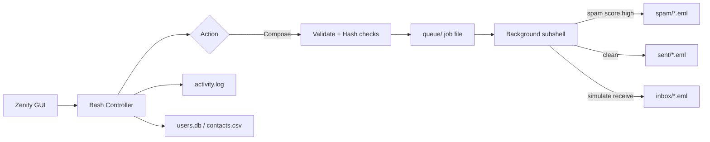

<p align="center">
  
  
  
  
</p>

<h1 align="center">Why So Serious Mail</h1>

<p align="center">
  <b>A full offline mail client — no servers, no cloud, no excuses.</b><br/>
  Built for <i>Daffodil International University</i> · CSE324 Operating System Lab · Group A1
</p>

<p align="center">
  <a href="#-quick-start"><strong>Quick Start</strong></a> ·
  <a href="#-what-you-can-do"><strong>Features</strong></a> ·
  <a href="#-architecture"><strong>Architecture</strong></a> ·
  <a href="#-os-concepts-in-action"><strong>OS Concepts</strong></a> ·
  <a href="#-team"><strong>Team</strong></a>
</p>

---

## Why this exists

Modern mail apps are heavy, cloud-bound, and opaque.  
**Why So Serious Mail** flips that: a Zenity-powered GUI on top of pure Bash, where every message is a file, every folder is a directory, and every send is a real background process you can see.

It is an **email management simulator** designed to teach (and show) operating-system fundamentals — while still feeling like a real product.

| | |
|---|---|
| **Privacy** | Everything stays in `~/.why_so_serious` on your machine |
| **Portable** | One script. Unix-like OS. No database server. |
| **Educational** | Processes, permissions, logging, queues — visible, not abstract |

---

## Quick start

### 1. Install Zenity

```bash
# macOS
brew install zenity

# Ubuntu / Debian
sudo apt install zenity
```

### 2. Clone & launch

```bash
git clone https://github.com/Hasin-99/why-so-serious-mail.git
cd why-so-serious-mail
chmod +x set_up_mail_server.sh
./set_up_mail_server.sh
```

### 3. First run

```
Create Account  →  username + password + email
                →  demo Inbox / Spam mail is seeded
                →  explore the main menu
```

> **Tip:** Password is stored as a **SHA-256 hash** only. There is no plaintext password file.

---

## What you can do

<table>
<tr>
<td width="50%">

### Mail core
- Compose / send with priority levels  
- Save drafts  
- Browse Inbox · Sent · Drafts · Spam · Trash  
- Open a message → **Reply / Forward / Star**  
- Move to trash · restore · delete forever  

</td>
<td width="50%">

### Power features
- **Search** across all folders  
- **Contacts** address book  
- **Quick templates** (lab, meeting, thanks…)  
- **File attachments** via picker  
- **Spam scoring** (keywords + ALL CAPS)  
- **Desktop notifications** on delivery  

</td>
</tr>
<tr>
<td>

### System tools
- Live **Dashboard** (counts, disk, perms, queue)  
- **Activity log** audit trail  
- **OS Concepts Demo** walkthrough  

</td>
<td>

### Security basics
- Account login gate  
- `chmod 700` private mailbox  
- `chmod 600` on secrets & mail files  

</td>
</tr>
</table>

### Main menu map

```
🦇 Why So Serious Mail
├── ✉  Compose / Send
├── 📝  Save Draft
├── 📂  Browse Mailboxes
├── 🔍  Search
├── ⚡  Quick Templates
├── 👤  Contacts
├── 📊  Dashboard
├── 🧹  Cleanup
├── 📜  Activity Log
├── 🧠  OS Concepts Demo
└── 🚪  Logout / Exit
```

---

## Architecture

Mail never “vanishes into the network.” It moves through a tiny local pipeline:



### On-disk layout

```text
~/.why_so_serious/                 # chmod 700 — your private vault
├── inbox/                         # unread + read .eml messages
├── sent/
├── drafts/
├── spam/
├── trash/
├── attachments/                   # staged files from the picker
├── queue/                         # pending delivery jobs
├── users.db                       # username:sha256:email
├── contacts.csv                   # Name|Email|Tag
├── activity.log                   # audit trail
└── config.env
```

### Message format (`.eml`)

Each email is a plain-text file — easy to `grep`, `awk`, or inspect by hand:

```text
Mail-ID: 0003
From: you@example.com
To: alfred@wayne.enterprise
CC:
Reply-To:
Subject: Lab tip: file permissions matter
Priority: High
Status: Unread
Starred: Yes
Attachment: notes.pdf
Date: 2025-04-16 14:22:01
Body:
chmod 700 on your mailbox keeps other users out.
```

### Sample activity log

```text
[2025-04-16 14:20:11] [INFO] [system] Mailbox initialized at /Users/you/.why_so_serious
[2025-04-16 14:20:45] [INFO] [hasin] Login success
[2025-04-16 14:21:03] [INFO] [hasin] Queued delivery job job_1744… (background PID 48291)
[2025-04-16 14:21:04] [INFO] [hasin] Delivered mail #0004 to alfred@wayne.enterprise
[2025-04-16 14:21:40] [WARN] [hasin] Spam filtered mail to winner@totally-legit.biz
```

---

## OS concepts in action

This is the academic heart of the project — not just a GUI wrapper.

| OS concept | Concrete implementation |
|------------|-------------------------|
| **Process management** | `send` forks a background subshell; UI shows the worker **PID** |
| **File system as DB** | Folders = labels, `.eml` files = records |
| **Access control** | Mailbox `700`, credentials & mail `600` |
| **Authentication** | Local user DB + SHA-256 password hashes |
| **IPC-style queue** | Job files under `queue/` before delivery |
| **System logging** | Append-only `activity.log` with levels |
| **Unix toolchain** | `grep` · `awk` · `sed` · `find` · `sort` · `du` · `stat` |
| **Error handling** | Validation, confirm dialogs, cancel paths |

Open **🧠 OS Concepts Demo** inside the app for the interactive version.

---

## Repository map

| File | Role |
|------|------|
| [`set_up_mail_server.sh`](./set_up_mail_server.sh) | **Main app** — advanced edition (run this) |
| [`set_up_mail_server_classic.sh`](./set_up_mail_server_classic.sh) | Original simpler build (kept for history) |
| [`setup_mail_server.sh`](./setup_mail_server.sh) | Early draft |
| [`dns_server.sh`](./dns_server.sh) | Related OS-lab networking script |
| [`ensure_dns_configuration.sh`](./ensure_dns_configuration.sh) | DNS helper |
| [`setup_printer_server.sh`](./setup_printer_server.sh) | Printer-server lab script |

---

## Troubleshooting

| Problem | Fix |
|---------|-----|
| `zenity: command not found` | `brew install zenity` or `sudo apt install zenity` |
| Dialogs don’t appear | Run from a normal terminal app (not a headless SSH session without X/Wayland) |
| Want a clean slate | `rm -rf ~/.why_so_serious` then relaunch |
| Permission weirdness | The app recreates `chmod 700` on the mailbox at startup |

---

## Team

**CSE324 · Group A1 · Daffodil International University**

| Member | ID |
|--------|-----|
| Md. Shadman Hasin | 0242220005101462 |
| Md. Shadman Tahsin | 0242220005101461 |
| Sheak Rakibur Rahman Rahat | 0242220005101498 |
| Mariea | 0242220005101527 |
| Zahin Muntaha Khan | 0242220005101473 |

**Supervisor:** Nushrat Jahan Oyshi, Lecturer  

---

## License

Educational project for **CSE324: Operating System Lab**.  
Fork it, break it, rebuild it — just learn something while you’re at it.

---

<p align="center">
  <sub>Why so serious? Because permissions matter.</sub>
</p>
